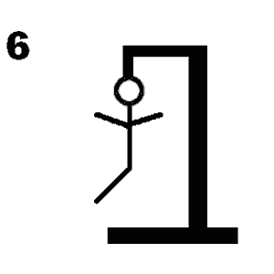

# Galgje – Git Collaboration

**Team:** <Teamnaam>  
**Spelvolgorde & contact:**
1. Lucas
2. Joris
3. Blue
4. Jakub
5. Amias

---

## Woordraster
<!-- Pas het aantal kolommen aan aan de woordlengte -->
| . | . | . | i | . | e | . | i | . | . | . | . | e |
| - | - | - | - | - | - | - | - | - | - | - | - | - |
| 1 | 2 | 3 | 4 | 5 | 6 | 7 | 8 | 9 | 10 | 11 | 12 | 13 |

## Status

---

## Beurtenlog
- beurt1: Lucas gokt "E"
- Goed!

- beurt2: Joris gokt "R"
- Fout!

- beurt3: Blue gokt "G"
- Fout!

- beurt4: Jakub gokt "B"
- Fout!

- beurt5: Amias gokt "F"
- Fout!

- beurt6: Lucas gokt "M"
- Fout!

- beurt7: Joris gokt "O"
- Fout!

- beurt8: Blue gokt "I"
- goed!
