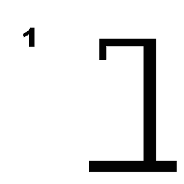

# Galgje – Git Collaboration

**Team:** <Teamnaam>  
**Spelvolgorde & contact:**
1. Lucas
2. Joris
3. Blue
4. Jakub
5. Amias

---

## Woordraster
<!-- Pas het aantal kolommen aan aan de woordlengte -->
| . | . | . | . | . | . | . | . | . | . | . | . |
| - | - | - | - | - | - | - | - | - | - | - | - |
| 1 | 2 | 3 | 4 | 5 | 6 | 7 | 8 | 9 | 10 | 11 | 12 |

## Status

---

## Beurtenlog
- beurt1: <Naam> gokt "?"
- (Git-master vult hier reactie in: goed/fout + updates)
- beurt2: ...
